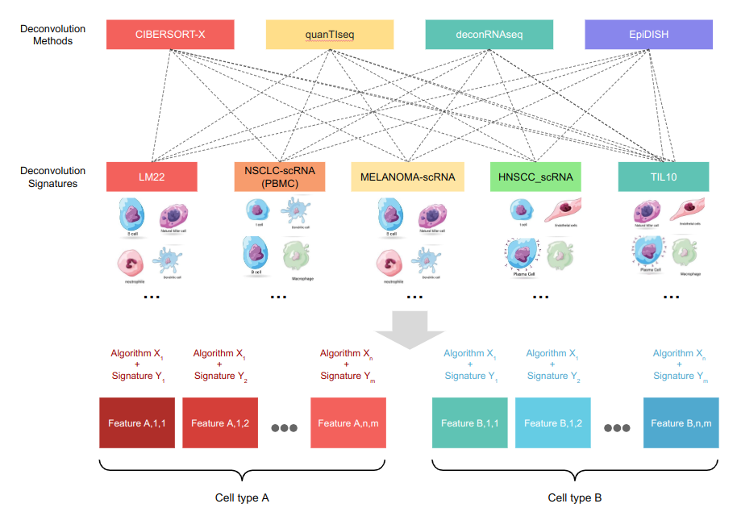

# GEMDeCan
GEMDeCan: Gene Expression and Methylation based Deconvolution for Cancer 

## Welcome to the GEMDeCan repository
You will find here a snakemake pipeline to perform immune cell type deconvolution using 6 methods and 12 signatures based on gene expression and methylation data.   



## Organization
 * **inputs** : Directory where your inputs are located along with the signatures files used in the pipeline.
 * **results** : Directory where your output will be saved. `cibersortx/` is where CibersortX results are saved, `deconvolutions/` is where results from all the other methods without CibersortX are saved and `all_deconvolutions/` is where all deconvolution results merged are saved.
 * **scripts** : Directory where you will find all the scripts produce to run the pipeline
   
## Using GEMDeCan

### Input file 

- **Gene expression matrix**: TPM normalized in .txt format

Format specification
```
gene    Sample1   Sample2   Sample3
 g1      1.8       5.2       4.1
 g2      5.7       8.3       2.0
 g3      6.2       3.1       9.2
 g4      7.2       9.1       0.6
```

Example of how to save the input file from R: 
```
write.table(counts.TPM.normalized, "GEMDeCan_deconvolution/inputs/file_name.txt", quote = F, sep = "\t", row.names = F)
```
If your gene expression matrix includes non coding genes associated with C/D Boxes (e.g. SNORD116-28) remove them before running the pipeline.

### Installation
Snakemake allows for a very efficient and user friendly way of using pipelines. It is designed so all you need to install is _mamba_ which is required to install Snakemake
Note that officially only Linux is supported for this pipeline. This also requires an Internet connection in order to use _mamba_ auto-generated environments for all necessary software and packages.

Mamba
* [Linux](https://github.com/mamba-org/mamba)
`curl -L -O "https://github.com/conda-forge/miniforge/releases/latest/download/Mambaforge-$(uname)-$(uname -m).sh"`
`bash Mambaforge-$(uname)-$(uname -m).sh`

Snakemake
* [Linux](https://snakemake.readthedocs.io/en/stable/getting_started/installation.html)
`conda activate base`
`mamba install snakemake -n base -c conda-forge -c bioconda`

Linux packages
` sudo apt install build-essential `
` sudo apt-get install r-base-dev `
` sudo apt-get install -y libtiff5-dev zlib1g-dev libpng-dev libxml2-dev  libharfbuzz-dev libfribidi-dev libcurl4-openssl-dev libfontconfig1-dev liblapack-dev libopenblas-dev `

Docker (If not already installed)
* [Linux](https://kinsta.com/blog/install-docker-ubuntu/#installing-docker-desktop-on-ubuntu)
` sudo apt install ca-certificates curl gnupg lsb-release `
` sudo mkdir -p /etc/apt/keyrings `
` curl -fsSL https://download.docker.com/linux/ubuntu/gpg | sudo gpg --dearmor -o /etc/apt/keyrings/docker.gpg `
` sudo chmod a+r /etc/apt/keyrings/docker.gpg `
` echo "deb [arch=$(dpkg --print-architecture) signed-by=/etc/apt/keyrings/docker.gpg] https://download.docker.com/linux/ubuntu $(lsb_release -cs) stable" | sudo tee /etc/apt/sources.list.d/docker.list > /dev/null `
` sudo apt update `
` sudo apt install docker-ce docker-ce-cli containerd.io `

R packages 

After running GEMDeCan succesfully for the first time, go to the files `scripts/run_cibersort_local_container.R`, `scripts/merge_all_deconvolutions.R` and `scripts/deconvolution/deconvolution_algorithms.R` and uncomment the first lines to avoid re-looking for them in the future.

### Configure your workspace
- Input file should be save in folder `inputs/`
- Go to the file `snakemake.yml` and add the name of your input file in the section `Mixtures`

### Run GEMDeCan
`sudo snakemake --cores 8 all`

## CIBERSORTX
CIBERSORTx is included in the deconvolution methods in the GEMDeCan pipeline, but it's not run by default as it's not an open-source program. 

To run it, please ask for a token in [CibersortX](https://cibersortx.stanford.edu/register.php) and create a file named `credentials.txt` with your username and password on separate lines. 

```{r}
MAIL: username123@email.com
TOKEN: token_passowrd123
```

## Citation 
To cite the pipeline, refer to our paper on [BiorXiv](https://www.biorxiv.org/content/10.1101/2021.04.09.439207v2) :  
**GEM-DeCan: Improved tumor immune microenvironment profiling through novel gene expression and DNA methylation signatures predicts immunotherapy response**  
Ting Xie, Jacobo Solorzano, Miguel Madrid-Mencía, Abdelmounim Essabbar, Julien Pernet, Mei-Shiue Kuo, Alexis Hucteau, Alexis Coullomb, Nina Verstraete, Olivier Delfour, Francisco Cruzalegui,  Vera Pancaldi 
bioRxiv 2021.04.09.439207; doi: https://doi.org/10.1101/2021.04.09.439207
